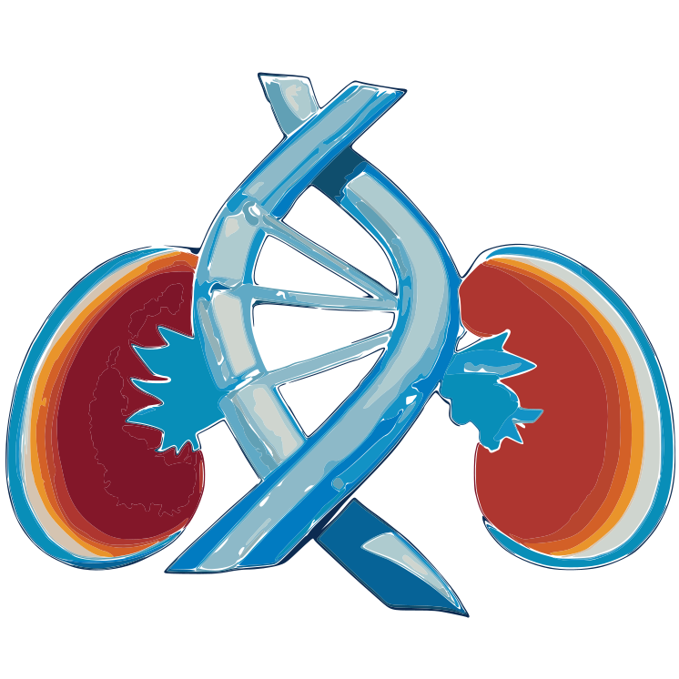

--- 
title: "The Kidney-Genetics Documentation"
author: "Bernt Popp, Nina Rank, Constantin Wolff, Jan Halbritter"
date: "`r Sys.Date()`"
site: bookdown::bookdown_site
output: bookdown::gitbook
bibliography: [kidney-genetics.bib]
csl: apa.csl
link-citations: yes
colorlinks: yes
description: "This documentation is intended to describe the Kidney-Genetics project"
graphics: yes
github-repo: halbritter-lab/kidney-genetics
url: https://halbritter-lab.github.io/kidney-genetics/
---

<!-- here we load required libraries -->
```{r setup, include=FALSE}
knitr::opts_chunk$set(echo = TRUE)
## Load libraries
library(readr) # needed to import CSV result files
library(tidyverse) # needed to transform the tables
library(DT) # needed to generate nice data tables in html
library(plotly) # needed for upset plots
library(knitr) # needed for draw.io files
library(knitrdrawio) # needed for draw.io files
library(config) # needed to load the config file
```

<!-- here we load the config file -->
```{r, echo=FALSE, message=FALSE, warning=FALSE}
project_topic <- "nephrology"
project_name <- "kidney-genetics"
script_path <- "/edit_docs/"

## read configs
config_vars_proj <- config::get(file = Sys.getenv("CONFIG_FILE"),
    config = project_topic)
```

<!-- here we load global functions libraries -->
```{r, echo=FALSE, message=FALSE, warning=FALSE}
# load global functions
# file functions
source("../analyses/functions/file-functions.R", local = TRUE)
```

<!-- TODO: load and filter (newest) the files automatically  -->
<!-- TODO: also compute other numbers with placeholders -->
<!-- TODO: version the image files with their computation date -->
<!-- TODO: create output folder if not existent -->

<!-- here we load the result csv file and compute numbers to update the diagrams -->
```{r, echo=FALSE, message=FALSE, warning=FALSE}
## load the CSV data
merge_analyses_sources <- read_csv("../analyses/A_MergeAnalysesSources/results/A_MergeAnalysesSources.2023-05-18.csv.gz")

# compute numbers for the diagrams
all_genes <- merge_analyses_sources %>%
    nrow()

high_evidence_genes <- merge_analyses_sources %>%
    filter(evidence_count > 2) %>%
    nrow()

clingen_genes <- "XXX"
manualscoring_genes <- "YYY"

replace_strings("static/img/figures/raw/curation_flow_diagram_raw.drawio",
    "static/img/figures/updated/curation_flow_diagram_current.drawio",
    c("ALL_GENES", "HIGHEVIDENCE_GENES", "CLINGEN_GENES", "MANUALSCORING_GENES"),
    c(all_genes, high_evidence_genes, clingen_genes, manualscoring_genes))
```

---

# Preface {-}

---------------------------------------

This documentation is intended to describe the [Kidney-Genetics](https://github.com/halbritter-lab/kidney-genetics) project.

<!-- here we place the logo -->
```{r, out.width='25%', fig.align='center', echo=FALSE, message=FALSE, warning=FALSE}

```

## Objective {-}

How can we address the lack of a unified and standardized database of kidney disease-associated genes, which hampers diagnosis, treatment, and research comparability in the field of kidney diseases?


## Methods {-}

To create a comprehensive and standardized database of kidney-related genes, we employed the following methods:

1. Utilized data from Genomics England and Australia PanelApp.
2. Conducted a comprehensive literature review of published gene lists.
3. Collected information from clinical diagnostic panels for kidney disease.
4. Performed a Human Phenotype Ontology (HPO)-based search in rare disease databases (OMIM, Orphanet).
5. Employed a PubTator API-based automated literature extraction from PubMed.

We also developed an evidence-scoring system to differentiate highly confirmed disease genes from candidate genes.

In order to make our approach more transparent and thus more comprehensible, we have attached our current workflow as a chart.  


```{drawio curation_flow_diagram, src="static/img/figures/updated/curation_flow_diagram_current.drawio", fig.cap = "Curation process flow diagram", engine.path = config_vars_proj$drawio_path}
```

## Results {-}

The "Kidney-Genetics" database currently includes detailed information on 2,906 kidney-associated genes. Notably, 439 genes (15.1%) are present in three or more of the analyzed information sources, indicating high confidence and their potential for diagnostic use.

To ensure currency, Kidney-Genetics will be regularly and automatically updated. We will also provide phenotypic and functional clustering results to facilitate gene grouping.


## Conclusion {-}

Kidney-Genetics is a comprehensive and freely accessible database that researchers can use to analyze genomic data related to kidney diseases. The database is regularly updated through a standardized pipeline and an automated system, ensuring it remains up-to-date with the latest advancements in kidney research and diagnostics.

By utilizing Kidney-Genetics, clinicians and researchers can enhance their understanding of the genetic aspects of kidney disorders.


## Outlook {-}

Future goals include manual curation and the assignment of diagnostic genes to specific nephrology disease groups, such as syndromic vs. isolated, adult- vs. pediatric-onset, and cystic vs. nephrotic, among others.